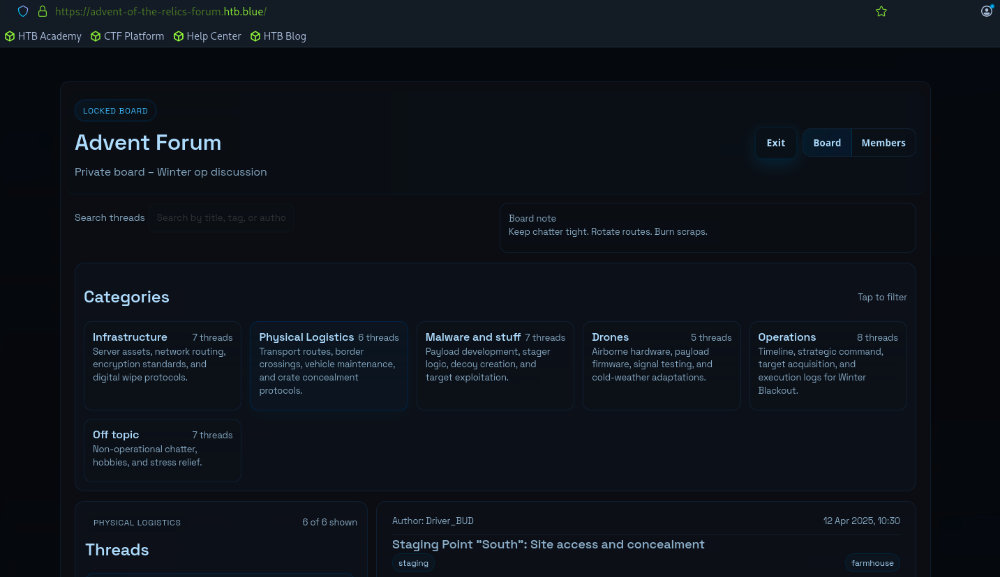
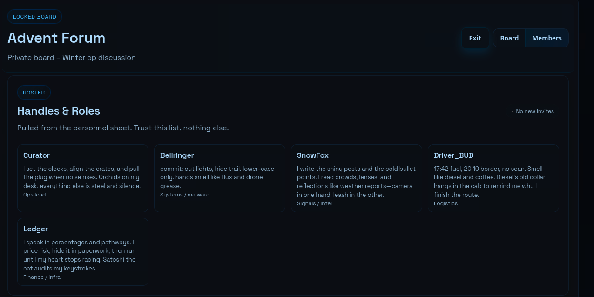
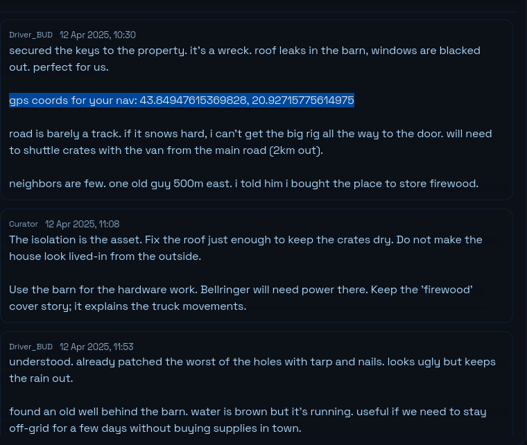
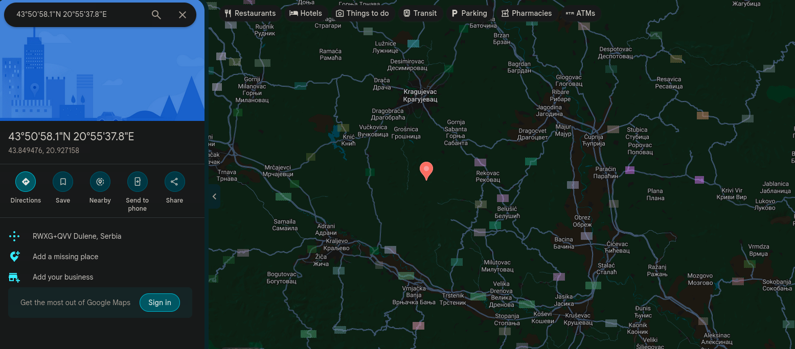

# Advent of The Relics 2 — Operation Winter Blackout

## Cyber Threat Intelligence Report

**Report Type:** Tactical / Operational Threat Intelligence  
**Platform:** Hack The Box Sherlock  
**Scenario:** Advent of The Relics 2 — Operation Winter Blackout  
**Classification:** Educational / Fictional Scenario  
**Primary Intelligence Source:** Private adversary forum  
**Assessment Confidence:** High for directly observed forum evidence

---

## Executive Summary

This investigation continued from **Advent of The Relics 1**, where analysis of a phishing attack uncovered malicious PowerShell activity, attacker-controlled infrastructure, and an embedded credential.

The recovered credential:

```text
Username: svc_temp
Password: SnowBlackOut_2026!
```

provided access to a private forum associated with the threat actors behind the campaign.

Analysis of the forum revealed a coordinated operation known as **Winter Blackout** involving five participants with clearly defined responsibilities across operations, malware, intelligence, logistics, and finance/infrastructure.

The threat actors demonstrated deliberate preparation across multiple stages of the attack lifecycle, including:

- Targeted phishing and behavioral profiling
- Typosquatted sender infrastructure
- Password-protected payload delivery
- Decoy-document creation
- User-space execution
- Dedicated and redundant C2 infrastructure
- Offshore infrastructure procurement
- Operational cover entities
- Physical staging and transportation
- Evidence-destruction planning
- Emergency maritime extraction

The operation was designed for synchronized execution using the activation keyword:

```text
FROST
```

at:

```text
23:59:50 on New Year's Eve
```

The intelligence indicates that Winter Blackout was a structured campaign combining cyber intrusion, social engineering, physical logistics, operational security, and post-operation escape planning.

---

## Key Judgments

- Operation Winter Blackout was a coordinated campaign involving both cyber and physical operational components.
- `Curator` is assessed with high confidence to be the group's operational leader.
- The group demonstrated clear functional specialization across malware, intelligence, logistics, and financial/infrastructure support.
- The phishing campaign was deliberately engineered around user behavior, trust cues, and reduced scrutiny.
- `health-status-rs.com` was identified as the primary C2 domain, with separate panel and fallback infrastructure also prepared.
- The actors intentionally selected infrastructure intended to resist abuse complaints and complicate takedown activity.
- Evidence destruction and emergency extraction were planned in advance, indicating deliberate operational-security preparation.
- The group demonstrated awareness of how defenders might investigate infrastructure after the attack and attempted to manipulate those indicators in advance.

---

## Connection to Part 1

During Part 1, analysis of a malicious `.lnk` file revealed PowerShell code that collected information from the compromised system and communicated with attacker-controlled infrastructure.

The PowerShell contained a Base64-encoded authentication value.

After decoding it, the following credential was recovered:

```text
Username: svc_temp
Password: SnowBlackOut_2026!
```

The recovered password became the pivot into the next phase of the investigation.

Part 2 shifted from endpoint-focused analysis into **threat intelligence analysis of the adversary's communications, infrastructure, personnel, intent, and operational planning**.

---

## Intelligence Source

The password recovered during Part 1 granted access to the private forum:

```text
https://advent-of-the-relics-forum.htb.blue
```

The forum contained discussions related to:

- Infrastructure
- Malware
- Physical logistics
- Operations
- Finance
- Intelligence collection
- Transport
- Evidence destruction
- Extraction planning

These communications provided both technical indicators and broader contextual intelligence about the threat group.

### Forum Access



*Figure 1: Private forum used by participants involved in Operation Winter Blackout.*

---

## Analysis Methodology

The investigation used the private forum as the primary intelligence source.

Analysis included:

- Reviewing forum member profiles and assigned roles
- Correlating information across multiple forum threads
- Extracting domains, filenames, aliases, dates, credentials, and geographic coordinates
- Identifying relationships between cyber and physical components of the operation
- Mapping geographic coordinates using public mapping services
- Separating directly observed facts from analytical assessments
- Assigning confidence levels based on the strength of supporting evidence
- Comparing forum intelligence with activity previously observed in Part 1

---

## Analytical Confidence

Confidence levels used throughout this report:

- **High:** Supported directly by forum evidence or multiple corroborating observations.
- **Moderate:** Supported by available evidence but requires analytical inference.
- **Low:** Plausible assessment with limited supporting evidence.

Confidence reflects the quality and consistency of available intelligence rather than the probability that a future event will occur.

---

# Threat Actor Structure

The forum member roster identified **five participants** involved in Operation Winter Blackout.

| Alias | Role | Assessed Function |
|---|---|---|
| `Curator` | Operations Lead | Strategic coordination and execution timing |
| `Bellringer` | Systems / Malware | Malware, C2, and technical operations |
| `SnowFox` | Signals / Intel | Reconnaissance, targeting, surveillance, and deception |
| `Driver_BUD` | Logistics | Transport, routes, staging, and extraction |
| `Ledger` | Finance / Infra | Finance, procurement, cover entities, and infrastructure |

### Forum Member Roster



*Figure 2: Forum roster identifying the five participants and their operational roles.*

---

## Curator — Operations Lead

The forum identified `Curator` as the group's operations lead.

The account was associated with:

- Operational timing
- Physical-asset coordination
- Execution decisions
- Overall operational control

### Assessment

Curator likely acted as the central coordinator and primary decision-maker for Winter Blackout.

**Confidence: High**

---

## Bellringer — Systems / Malware

`Bellringer` was responsible for:

```text
Systems / Malware
```

Forum activity linked Bellringer directly to C2 deployment, listener preparation, infrastructure registration, and technical operational planning.

### Assessment

Bellringer appears to have served as the group's primary technical operator, responsible for malware-related activity, C2 infrastructure, and systems operations.

**Confidence: High**

---

## SnowFox — Signals / Intelligence

`SnowFox` was assigned to:

```text
Signals / Intel
```

Forum communications associated SnowFox with:

- Target selection
- Behavioral analysis
- Phishing delivery
- Decoy-document preparation
- Deception
- Intelligence collection

### Assessment

SnowFox likely performed reconnaissance, target profiling, and social-engineering preparation.

**Confidence: High**

---

## Driver_BUD — Logistics

`Driver_BUD` was responsible for:

```text
Logistics
```

Forum posts associated the account with:

- Fuel planning
- Border crossings
- Route selection
- Vehicle movement
- Remote staging areas
- Equipment transport
- Emergency extraction

Additional intelligence identified Driver_BUD's first name as:

```text
Daniel
```

### Assessment

Driver_BUD appears to have coordinated physical transportation, staging, and contingency movement of personnel and equipment.

**Confidence: High**

---

## Ledger — Finance / Infrastructure

`Ledger` was identified as responsible for:

```text
Finance / Infra
```

Forum communications linked Ledger to:

- Infrastructure procurement
- Payment planning
- Cover entities
- Domain-registration strategy
- Operational paperwork
- Risk management

### Assessment

Ledger likely handled the financial and administrative infrastructure required to support the operation while reducing attribution and takedown risk.

**Confidence: High**

---

# Initial Access and Social Engineering

Forum communications provided detailed insight into how the phishing campaign was designed.

The malicious shortcut was intended to appear as a normal document or portal link:

```text
EU_Health_Compliance_Portal.lnk
```

The actors deliberately wanted the lure to appear mundane and administrative.

A health/compliance theme was selected because recipients would be less likely to question routine paperwork.

The payload was also designed to execute entirely in:

```text
User space
```

The actors explicitly anticipated that an unexpected administrator prompt would increase suspicion and reduce the likelihood of execution.

### Assessment

The phishing chain was designed around human behavior rather than technical exploitation alone.

The actors intentionally reduced friction, suspicion, and privilege requirements to increase the probability of successful execution.

**Confidence: High**

---

## Decoy Document

`SnowFox` created a decoy PDF named:

```text
Health_Clearance_Guidelines.pdf
```

The document contained dense, plausible content related to:

- Flu outbreak protocols
- Customs requirements
- Health-clearance procedures

The purpose of the document was to reinforce the legitimacy of the lure after execution of the malicious shortcut.

A small EU flag icon was also added to the PDF as a visual trust cue.

### Assessment

The decoy document acted as a post-execution deception mechanism.

If the victim expected health-compliance documentation and a legitimate-looking PDF appeared, they would have less reason to suspect that additional malicious activity had occurred.

The use of official-looking EU branding further increased perceived legitimacy.

**Confidence: High**

---

## Archive Packaging

The phishing package was distributed as:

```text
Health_Clearance-December_Archive.zip
```

The archive password was:

```text
Up7Pk99G
```

Forum communications stated that password protection was intentionally used to reduce automated email-security inspection.

### Delivery Chain

```text
Health_Clearance-December_Archive.zip
        |
        v
Password-Protected Archive
        |
        +-- EU_Health_Compliance_Portal.lnk
        |
        +-- Health_Clearance_Guidelines.pdf
                 |
                 v
          Legitimate-Looking Decoy
```

### Assessment

The delivery package combined security-control evasion with social engineering.

The archive password, benign naming, decoy PDF, and malicious shortcut were designed to work together rather than as independent artifacts.

**Confidence: High**

---

# Sender Infrastructure and Impersonation

The group registered the sender domain:

```text
eu-health-partnrs.org
```

The domain deliberately omitted the letter `e` from `partners`.

The planned sender display name was:

```text
EU Health Compliance Team
```

Forum discussion explicitly noted that many email clients emphasize the display name more strongly than the underlying sender domain.

### Assessment

The campaign used layered impersonation techniques:

- Typosquatted sender domain
- Trusted-sounding display name
- Health/compliance messaging
- EU visual branding
- Password-protected delivery
- Legitimate-looking decoy document

The domain was subtle enough to survive a quick visual inspection while remaining distinct from a legitimate domain.

**Confidence: High**

---

## Domain Registration Strategy

`Ledger` reported that:

```text
eu-health-partnrs.org
```

had been paid for **two years in advance**.

The domain was intentionally registered approximately six months before operational use.

The stated objective was to ensure that later WHOIS analysis would show an older, more established registration rather than infrastructure created immediately before the attack.

### Assessment

This indicates deliberate preparation to manipulate how defenders would interpret the infrastructure during retrospective investigation.

The actors attempted to make the domain appear established rather than opportunistic.

This shows awareness not only of initial delivery techniques, but also of post-incident investigative behavior.

**Confidence: High**

---

# Targeting and Delivery Strategy

On **14 Nov 2025 at 20:33**, `SnowFox` reported that the phishing campaign had been sent to a four-person target list in **Belgrade**.

The subject line was:

```text
URGENT: Updated Health & Customs Compliance - December Archive
```

The message body included:

- The password needed to open the ZIP archive
- Instructions directing the recipient to use the included shortcut

The primary target was:

```text
Kamil Poltavez
kamil.poltavez@cale-corp.org
```

Kamil Poltavez was identified as a:

```text
Logistics Coordinator
```

Forum communications indicated that the group had reviewed his overtime work patterns and believed he was particularly likely to interact with the message during the selected delivery window.

The campaign targeted:

```text
4 recipients
```

The group believed that only one successful interaction was necessary.

### Assessment

The phishing campaign was targeted and behaviorally informed rather than broadly distributed.

The actors considered:

- Recipient job role
- Work schedule
- Fatigue
- Time pressure
- Delivery timing
- Message urgency
- Organizational context

The late-evening timing was intentionally selected to increase the probability that recipients would act quickly and scrutinize the message less carefully.

**Confidence: High**

---

# Campaign Identification

The operation was identified internally as:

```text
Winter Blackout
```

The group planned to use the activation command:

```text
FROST
```

to trigger distributed components of the operation.

The scheduled execution time was:

```text
23:59:50
New Year's Eve
```

### Assessment

The use of a common trigger word and precise activation time indicates centralized coordination and synchronized execution.

**Confidence: High**

---

# Operational Cover

The threat actors planned to use a fake exhibition named:

```text
Miracles of Winter
```

as operational cover.

A shell company was also identified:

```text
Danube Event Solutions Ltd
```

### Assessment

The use of both a public-facing event and shell company suggests deliberate attempts to provide plausible explanations for:

- Personnel movement
- Equipment
- Transportation
- Financial activity
- Business documentation

**Confidence: High**

---

# Command-and-Control Infrastructure

On **08 Nov 2025 at 02:07**, `Bellringer` reported that listeners were ready to be deployed and that the C2 cluster was being registered.

The post identified:

```text
Primary:
health-status-rs.com

Panel:
panel.winter-lights-status.com

Fallback:
eu-logistics-node.net
```

The group planned to use:

```text
Let's Encrypt
```

for TLS certificates, with short certificate lifetimes and automatic renewal.

Bellringer stated that the infrastructure was intentionally designed to appear similar to systems used by government subcontractors.

### Infrastructure Summary

| Role | Indicator | Assessment |
|---|---|---|
| Primary C2 | `health-status-rs.com` | Primary beacon/listener infrastructure |
| Management Panel | `panel.winter-lights-status.com` | C2 management interface |
| Fallback Infrastructure | `eu-logistics-node.net` | Backup communications channel |
| TLS | Let's Encrypt | Automated certificate deployment and renewal |

### Assessment

The infrastructure demonstrates deliberate redundancy and operational resilience.

The group maintained:

- Primary infrastructure
- Separate management infrastructure
- Fallback infrastructure
- Valid TLS certificates
- Benign-looking domain names

The fallback domain suggests the group anticipated possible disruption or blocking of the primary C2 channel.

The naming strategy and use of legitimate TLS certificates were intended to make the infrastructure appear less suspicious during casual inspection.

**Confidence: High**

---

# Hosting and Infrastructure Procurement

Additional forum intelligence revealed that the group acquired dedicated hosting infrastructure in:

```text
Panama
```

The rack slot was reportedly routed through a:

```text
Seychelles-based entity
```

Payment was made using:

```text
Monero
```

for six months in advance.

The service was listed under the cover description:

```text
Cloud Storage Consulting
```

The hardware configuration was:

```text
Dual Xeon
64 GB ECC RAM
2 x 2 TB NVMe
RAID 1
```

The forum post also stated that the provider had a highly permissive abuse-response policy.

The group assessed the probability of seizure without advance legal warning as extremely low.

### Assessment

The hosting environment appears to have been selected specifically for:

- Resilience
- Anonymity
- Jurisdictional separation
- Reduced abuse-response risk
- Long-term availability

The use of:

- Offshore intermediary entities
- Cryptocurrency payment
- Long-term prepayment
- Business-cover labeling
- Dedicated hardware
- Redundant storage

indicates that the group was attempting to create persistent infrastructure resistant to routine disruption or takedown.

**Confidence: High**

---

# Physical Staging Infrastructure

A forum post authored by `Driver_BUD` described a remote property intended for staging activity.

The discussion referenced:

- A barn being used for hardware work
- Maintaining electrical power
- Concealing signs of occupancy
- Protecting equipment from weather
- Avoiding attention from nearby residents
- Using a firewood story as cover
- Remaining off-grid
- Moving equipment without attracting attention

The post contained the coordinates:

```text
43.84947615369828, 20.92715775614975
```

### Source Evidence



*Figure 3: Driver_BUD discussing the remote staging property and providing geographic coordinates.*

---

## Geospatial Analysis

The coordinates were mapped using public mapping services to determine the physical location associated with the staging site.



*Figure 4: Geospatial analysis of the coordinates recovered from the forum.*

### Assessment

The site appears to have been selected for:

- Low visibility
- Space for equipment
- Reduced dependence on public infrastructure
- Limited nearby population
- Plausible vehicle movement
- Temporary off-grid operations

**Confidence: High**

---

# Transportation

The vehicle used for transport was identified as:

```text
Volvo FH
```

### Assessment

The use of a commercial truck suggests that the group expected to move significant equipment or materials.

Combined with the shell company, staging location, and fake exhibition, the transportation plan appears designed to provide both capability and plausible cover.

**Confidence: Moderate**

---

# Evidence Destruction

The group identified a script named:

```text
burn_cycle.sh
```

for destroying evidence following the operation.

### Assessment

The existence of a named wipe script indicates that anti-forensic activity was planned before execution.

Evidence destruction was therefore part of the operational lifecycle rather than an improvised response to detection.

**Confidence: High**

---

# Escape and Extraction Plan

The escape vessel was identified as:

```text
Adriatic Wind
```

The captain was identified as:

```text
Stavros
```

Emergency extraction coordinates for `Driver_BUD` were:

```text
37.936489, 23.68644
```

Mapping placed the extraction point in the marina area near:

```text
Piraeus, Greece
```

### Extraction Location


*Figure 5: Mapping of the emergency extraction coordinates associated with Driver_BUD.*

### Assessment

The group had prepared contingency plans for post-operation movement.

The use of a designated vessel and emergency extraction location suggests the actors anticipated the possibility that normal transportation routes might become unavailable.

**Confidence: High**

---

# Campaign Timeline

| Date / Time | Event |
|---|---|
| 12 Apr 2025 | Driver_BUD discusses remote staging property |
| Approx. mid-2025 | Phishing domain aged before operational use |
| 20 Oct 2025 | Phishing lure, decoy document, and archive prepared |
| 08 Nov 2025 | C2 cluster and listener infrastructure prepared |
| 14 Nov 2025, 20:33 | Phishing emails delivered to Belgrade targets |
| 2026-11-12 | C2 listeners scheduled to become operational |
| New Year's Eve, 23:59:50 | `FROST` activation planned |
| Post-operation | Evidence destruction and extraction planned |

---

# Intelligence Summary

| Category | Indicator / Finding | Confidence |
|---|---|---|
| Campaign | `Winter Blackout` | High |
| Operations Lead | `Curator` | High |
| Systems / Malware | `Bellringer` | High |
| Signals / Intelligence | `SnowFox` | High |
| Logistics | `Driver_BUD` | High |
| Finance / Infrastructure | `Ledger` | High |
| Associated Identity | `Driver_BUD -> Daniel` | High |
| Phishing Domain | `eu-health-partnrs.org` | High |
| Display Name | `EU Health Compliance Team` | High |
| Malicious Shortcut | `EU_Health_Compliance_Portal.lnk` | High |
| Decoy PDF | `Health_Clearance_Guidelines.pdf` | High |
| Delivery Archive | `Health_Clearance-December_Archive.zip` | High |
| Archive Password | `Up7Pk99G` | High |
| Email Subject | `URGENT: Updated Health & Customs Compliance - December Archive` | High |
| Primary Target | Kamil Poltavez | High |
| Target Email | `kamil.poltavez@cale-corp.org` | High |
| Primary C2 | `health-status-rs.com` | High |
| Management Panel | `panel.winter-lights-status.com` | High |
| Fallback C2 | `eu-logistics-node.net` | High |
| Hosting Location | Panama | High |
| Procurement Entity | Seychelles-based entity | High |
| Infrastructure Payment | Monero | High |
| Cover Description | `Cloud Storage Consulting` | High |
| Activation Command | `FROST` | High |
| Cover Event | `Miracles of Winter` | High |
| Shell Company | `Danube Event Solutions Ltd` | High |
| Wipe Script | `burn_cycle.sh` | High |
| Transport | `Volvo FH` | High |
| Escape Vessel | `Adriatic Wind` | High |
| Extraction Point | `37.936489, 23.68644` | High |

---

# Defensive Implications

Based on the collected intelligence, defenders investigating activity associated with Winter Blackout should prioritize:

- DNS and proxy activity involving:
  - `health-status-rs.com`
  - `panel.winter-lights-status.com`
  - `eu-logistics-node.net`
  - `eu-health-partnrs.org`

- Email telemetry involving:
  - `EU Health Compliance Team`
  - `URGENT: Updated Health & Customs Compliance - December Archive`
  - `Health_Clearance-December_Archive.zip`

- Endpoint artifacts including:
  - `EU_Health_Compliance_Portal.lnk`
  - `Health_Clearance_Guidelines.pdf`
  - `burn_cycle.sh`

- Authentication or communications referencing:
  - `FROST`
  - `Winter Blackout`
  - `Miracles of Winter`

- Endpoint activity involving:
  - User-space PowerShell execution
  - Scripted deletion
  - Anti-forensic behavior
  - Unexpected outbound C2 connections

Indicators should be correlated across:

- Email security logs
- DNS telemetry
- Proxy logs
- Firewall data
- EDR
- Authentication logs
- SIEM telemetry

rather than investigated independently.

---

# Recommended Defensive Actions

## Priority 1 — Email Investigation

Search historical email telemetry for:

```text
eu-health-partnrs.org
EU Health Compliance Team
Health_Clearance-December_Archive.zip
EU_Health_Compliance_Portal.lnk
Health_Clearance_Guidelines.pdf
```

Identify recipients and determine whether the archive or shortcut was opened.

---

## Priority 2 — Network Detection

Search DNS, proxy, firewall, and endpoint network telemetry for:

```text
health-status-rs.com
panel.winter-lights-status.com
eu-logistics-node.net
```

Systems communicating with any of these domains should be investigated for related campaign activity.

---

## Priority 3 — Endpoint Analysis

Search endpoints for:

```text
EU_Health_Compliance_Portal.lnk
burn_cycle.sh
```

Review associated:

- PowerShell execution
- Child processes
- File creation
- Network activity
- Registry interaction
- Deletion activity

---

## Priority 4 — Evidence Preservation

Because the threat actors planned anti-forensic activity, relevant endpoint and network telemetry should be preserved before remediation where operationally appropriate.

---

# Intelligence Gaps

Several questions remain unresolved:

- What malware family communicates with the C2 infrastructure?
- What protocol and ports are used for beacon traffic?
- What systems receive the `FROST` activation command?
- What actions occur after `FROST` is issued?
- What functionality is contained within `burn_cycle.sh`?
- Are additional fallback domains or servers available?
- What are the real identities of the remaining forum members?
- What additional infrastructure is associated with the Panama hosting environment?
- Is the maritime extraction route primary or only a contingency?
- What additional users received the phishing email?
- Which recipient ultimately executed the malicious shortcut?

These gaps would guide additional intelligence collection.

---

# Overall Assessment

Operation Winter Blackout represents a structured campaign combining:

```text
Reconnaissance
      |
      v
Target Profiling
      |
      v
Phishing Infrastructure Preparation
      |
      v
Social Engineering
      |
      v
Malicious LNK Execution
      |
      v
C2 Communication
      |
      v
Operational Coordination
      |
      v
Physical Logistics
      |
      v
Evidence Destruction
      |
      v
Extraction
```

The private forum revealed a team with clearly defined responsibilities covering:

- Operations
- Malware
- Intelligence
- Logistics
- Finance
- Infrastructure

The actors demonstrated preparation not only for compromise and execution, but also for:

- Detection avoidance
- Infrastructure resilience
- Attribution resistance
- Evidence destruction
- Physical escape

The most valuable intelligence was not any single IOC.

It was the correlation between infrastructure, personnel, targeting, operational planning, and physical logistics.

This demonstrates how threat intelligence can expand an endpoint investigation into a broader understanding of adversary **intent, capabilities, infrastructure, personnel, and future activity**.

---

# Skills Demonstrated

- Cyber Threat Intelligence
- OSINT
- IOC Extraction
- Infrastructure Analysis
- Phishing Analysis
- Threat Actor Profiling
- Campaign Analysis
- Geospatial Analysis
- Intelligence Correlation
- Adversary Communications Analysis
- Defensive Recommendations
- Analytical Reporting

---

## Previous Investigation

[Part 1 — Initial Access & PowerShell Analysis](../Part-1/README.md)

## Next Investigation

Part 3 — Coming Soon

---

## Disclaimer

This report documents a fictional scenario created by Hack The Box for educational purposes.

All threat actors, infrastructure, organizations, identities, credentials, and events described in the scenario are fictional and should not be interpreted as representing real-world criminal activity.
