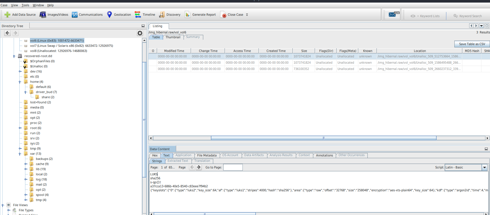
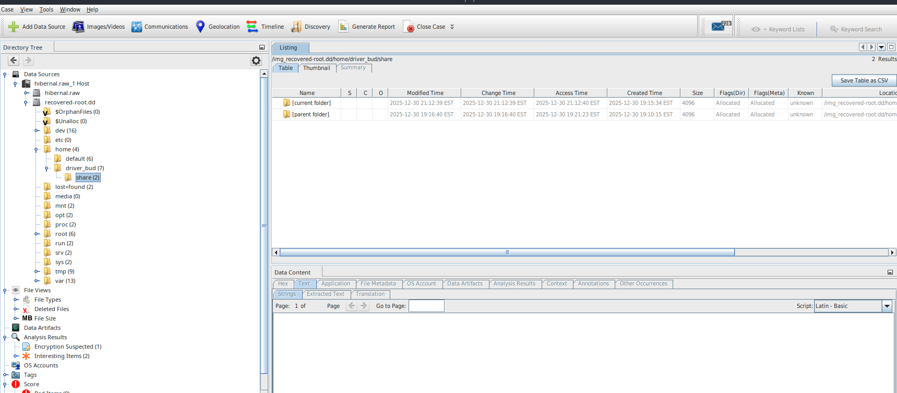
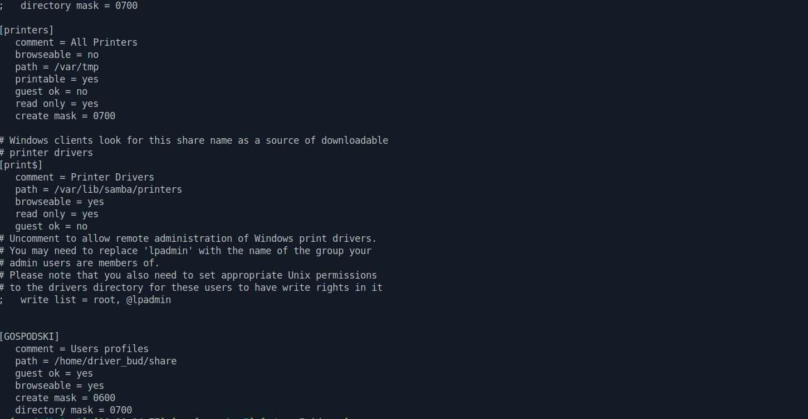
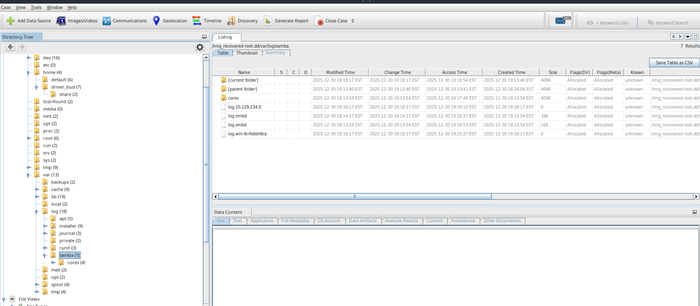
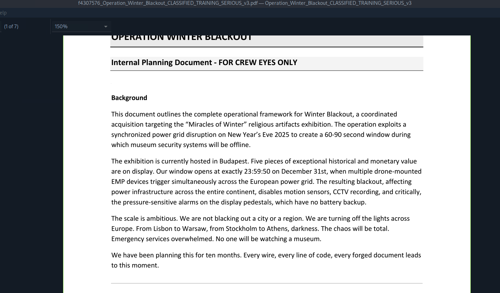
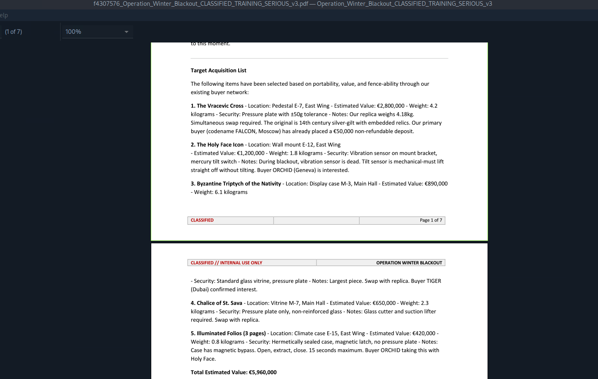

# Advent of The Relics 3 — Digital Forensics Investigation

## Digital Forensics & Incident Reconstruction Report

**Platform:** Hack The Box Sherlock  
**Campaign:** Advent of The Relics — Operation Winter Blackout  
**Primary Evidence:** `hibernal.E01`  
**Evidence Type:** EnCase / EWF Physical Disk Image  
**Classification:** Educational / Fictional Scenario  
**Overall Assessment Confidence:** High for directly observed forensic artifacts

---

# Executive Summary

Part 3 of the Advent of the Relics investigation focused on the forensic examination of a disk recovered from an abandoned farmhouse associated with **Operation Winter Blackout**.

The location had previously been identified during the Part 2 threat-intelligence investigation. According to the scenario, investigators arrived after the property had been abandoned and recovered a single storage device from the site.

The disk was preserved as:

```text
hibernal.E01
```

Forensic analysis identified a Linux-based system containing a **LUKS2-encrypted volume**. The encrypted partition was successfully unlocked after AES key material was recovered from the raw evidence image, reconstructed into the expected AES-XTS key format, and validated using `cryptsetup`.

Analysis of the decrypted filesystem identified a user profile named:

```text
driver_bud
```

This naming was consistent with the `Driver_BUD` logistics actor previously identified during Part 2.

Further analysis identified:

- A Samba share mapped to `/home/driver_bud/share`
- Guest-enabled and browseable Samba configuration
- Samba log artifacts containing a host-specific IP reference
- Deleted or orphaned files recoverable through PhotoRec
- Multiple PDF documents related to Winter Blackout
- Operational, technical, logistical, and emergency-planning information
- Independent confirmation of the `FROST` activation codeword
- Independent confirmation of the scheduled execution time `23:59:50`
- Identification of a modified `DJI Matrice 300`
- Budapest as the planned crew location during execution
- An estimated total value of **€5,960,000** for the targeted artifacts

The recovered disk provides strong forensic corroboration of intelligence obtained during Part 2 and supports the assessment that the system was directly associated with the planning or logistical support of Operation Winter Blackout.

---

# Key Findings

1. The recovered disk contained a **LUKS2-encrypted Linux volume** using `aes-xts-plain64`.

2. The full raw disk image, `hibernal.raw`, was scanned with `aeskeyfind` for structures consistent with AES key schedules.

3. Two frequently occurring 256-bit AES key candidates were identified.

4. The two values were combined into the 64-byte key material expected by the identified AES-XTS configuration.

5. The reconstructed key successfully unlocked the LUKS2 partition using `cryptsetup`.

6. The decrypted filesystem contained:

```text
/home/driver_bud/
```

7. A directory at:

```text
/home/driver_bud/share
```

was configured as a Samba network share named:

```text
GOSPODSKI
```

8. Samba logs included the host-specific filename:

```text
log.10.129.234.0
```

although the file itself contained no log entries.

9. PhotoRec recovered multiple files containing Winter Blackout operational material.

10. The recovered documents independently corroborated intelligence from Part 2, including:

```text
Activation codeword: FROST
Scheduled execution: 23:59:50
```

11. Additional recovered operational intelligence included:

```text
Modified drone: DJI Matrice 300
Crew location: Budapest
Estimated artifact value: €5,960,000
```

---

# Scenario Context

During Part 2, threat-intelligence analysis identified geographic coordinates connected to Operation Winter Blackout.

According to the Hack The Box scenario, investigators followed those coordinates to an isolated farmhouse. The property appeared abandoned by the time investigators arrived.

A single disk was recovered from the site.

The forensic image created from that disk became the primary evidence source for this phase of the investigation:

```text
hibernal.E01
```

Because the disk was recovered from suspected attacker-controlled infrastructure, this investigation differed from a traditional victim-endpoint examination.

The objectives were instead to reconstruct the threat actors' own:

- Operational activity
- User accounts
- Stored files
- Network-sharing configuration
- Deleted or recoverable data
- Planning documentation
- Logistics
- Connections to previously identified Winter Blackout actors

> **Note:** Operation Winter Blackout is a fictional Hack The Box scenario created solely for educational and training purposes.

---

# Scope

This examination was limited to the provided `hibernal.E01` forensic image and derived working copies created during analysis.

No live-system acquisition, volatile-memory capture, packet capture, or additional physical media was available for examination.

Evidence acquisition occurred prior to this analysis. My examination began with the provided E01 evidence image.

---

# Investigation Objectives

The forensic examination sought to determine:

- What type of system was contained on the recovered disk?
- Was the disk encrypted?
- Could the encrypted data be recovered?
- Which users or aliases were associated with the system?
- What files and directories were relevant to Winter Blackout?
- Was network file sharing configured?
- Was there evidence of remote-system interaction?
- Could deleted or orphaned artifacts be recovered?
- Did the disk contain operational planning material?
- Could recovered artifacts be correlated with intelligence discovered during Parts 1 and 2?

---

# Evidence Inventory

| Evidence | Type | Purpose |
|---|---|---|
| `hibernal.E01` | EWF / EnCase forensic image | Original acquired evidence |
| `hibernal.raw` | Raw disk export | Working image for Linux block-device analysis |
| `/dev/loop2` | Loop device | Block-device representation of raw image |
| `/dev/loop2p5` | LUKS2 partition | Encrypted evidence volume |
| `/dev/mapper/decrypted_full` | Decrypted device-mapper volume | Unlocked evidence volume |
| `recovered-root.dd` | Raw decrypted image | Decrypted working image imported into Autopsy |
| `recup_dir.*` | PhotoRec output | Carved files recovered from evidence |

---

# Evidence Integrity

The original forensic evidence and derived working images were hashed to document the exact files used during analysis.

| Evidence | Hash Type | Hash |
|---|---|---|
| `hibernal.E01` | SHA-256 | `09690156559b39e6f8a7f07013be6093b397edd1de9c3267efdc2902dc7aba9b` |
| Exported evidence data from `hibernal.E01` | MD5 | `9eaadfc4ab9fe1af3690e5cab25f2d76` |
| `hibernal.raw` | SHA-256 | `40cacbdd0121ef2e8236653a2c077e1886919506f2bf281457bb0e73b41ba2f1` |
| `recovered-root.dd` | SHA-256 | `1b231b18bbfd5dcf62d46874493191814041a8aeac2bdd66305bf861cfef0857` |

The SHA-256 value for `hibernal.E01` identifies the original evidence container.

The hashes for `hibernal.raw` and `recovered-root.dd` identify the derived working images used during analysis.

The MD5 value reported by `ewfexport` represents the exported evidence data and should not be confused with a file-level hash of the E01 container itself.

---

# Evidence Metadata

The original forensic image was examined using:

```bash
ewfinfo hibernal.E01
```

The EWF metadata contained the following information:

| Field | Value |
|---|---|
| Case Number | `K-122/2025` |
| Evidence Number | `D-500` |
| Evidence File | `hibernal.E01` |
| Acquisition Date | `31 Dec 2025 03:50:58` |
| Acquisition Tool | FTK Imager |
| Software Version | `ADI4.7.3.81` |
| Acquisition OS | Windows 201x |
| Media Type | Fixed Disk |
| Physical Media | Yes |
| Sector Size | 512 bytes |
| Sector Count | 14,680,064 |
| Media Size | 7,516,192,768 bytes / approximately 7.0 GiB |
| Compression | Deflate / no compression |
| Corruption Flag | Yes |

The acquisition description stored inside the evidence stated:

```text
Disk zaplenjen u akciji Operation Winter Blackout.
Pronadjen u napustenom privatnom posedu 28.12.2025.,
zahteva se hitna analiza.
```

Translated:

> Disk seized during Operation Winter Blackout. Found at an abandoned private property on 28 December 2025. Urgent analysis requested.

---

# Evidence Integrity Considerations

The EWF metadata reported:

```text
Is corrupted: yes
```

This was treated as a limitation of the evidence source.

The corruption flag does not mean that all recovered data is invalid. However, it means that missing, malformed, or unreadable artifacts cannot automatically be attributed to deletion or anti-forensic activity.

Findings were therefore strengthened where possible through:

- Cross-artifact correlation
- Direct filesystem inspection
- Independent command-line verification
- Recovered configuration files
- Recovered operational documents
- Correlation with Part 2 intelligence

---

# Timestamp Handling

Timestamps are reported as displayed by the source artifacts unless otherwise noted.

Timezone normalization was not independently verified.

---

# Tools Used

The investigation used the following tools:

- **Autopsy 4.22.1** — forensic filesystem and artifact analysis
- `ewfinfo` — EWF metadata inspection
- `ewfexport` — EWF-to-raw evidence export
- `losetup` — raw-image block-device mapping
- `cryptsetup` — LUKS decryption
- `aeskeyfind` — AES key-schedule discovery
- `lvs` — logical-volume inspection
- `dd` — creation of decrypted forensic working image
- **PhotoRec** — signature-based file carving
- `grep` — recursive artifact searching
- `find` — targeted file discovery
- `sha256sum` — artifact integrity hashing
- `xdg-open` — recovered-document review
- Standard Linux filesystem utilities

---

# Forensic Workflow

```text
hibernal.E01
      |
      v
EWF Metadata Examination
      |
      v
ewfexport
      |
      v
hibernal.raw
      |
      v
losetup
      |
      v
/dev/loop2
      |
      v
/dev/loop2p5
      |
      v
LUKS2 Identification
      |
      v
aeskeyfind against hibernal.raw
      |
      v
AES Key Reconstruction
      |
      v
cryptsetup validation
      |
      v
/dev/mapper/decrypted_full
      |
      +-----------------------+
      |                       |
      v                       v
Read-Only Mount              dd
      |                       |
      v                       v
Filesystem Review      recovered-root.dd
                              |
                              v
                           Autopsy
                              |
                              v
                          PhotoRec
                              |
                              v
                      Recovered Artifacts
```

---

# Evidence Preparation

The original EWF image was exported to a raw disk image using:

```bash
ewfexport -f raw -t hibernal hibernal.E01
```

The export processed:

```text
7,516,192,768 bytes
approximately 7.0 GiB
```

The export completed successfully.

The resulting raw image was used for subsequent Linux block-device and encryption analysis.

The SHA-256 hash of the raw image was:

```text
40cacbdd0121ef2e8236653a2c077e1886919506f2bf281457bb0e73b41ba2f1
```

---

# Raw Image Mapping

The raw image was attached to a Linux loop device using:

```bash
sudo losetup -fP hibernal.raw
```

The image was assigned:

```text
/dev/loop2
```

Partition scanning exposed the underlying partitions, including:

```text
/dev/loop2p5
```

which was later identified as the encrypted evidence volume.

---

# Encrypted Volume Identification

The raw image was examined in **Autopsy 4.22.1** using its encryption-detection functionality.

Autopsy identified an encrypted volume associated with `vol6`.

Recovered metadata showed:

| Field | Value |
|---|---|
| Encryption Format | LUKS2 |
| Cipher | `aes-xts-plain64` |
| KDF | `argon2id` |
| Hash | `sha256` |
| AF Stripes | `4000` |
| Key Size | 64 bytes |
| UUID | `a37cca13-686b-40e5-8540-c83eee7f94b2` |

### Source Evidence



*Figure 1: Autopsy encryption metadata identifying the LUKS2-protected volume.*

### Analysis

The metadata established that the protected partition used Linux Unified Key Setup version 2.

The reported key size of 64 bytes is consistent with the total key material used by AES-XTS with two AES-256 components.

Access to the underlying filesystem therefore required recovery or reconstruction of the correct key material.

**Confidence: High**

---

# AES Key Recovery

I used `aeskeyfind` to scan the full raw evidence image for AES key schedules:

```bash
aeskeyfind hibernal.raw
```

Although `aeskeyfind` is primarily intended for memory images, it scans the supplied byte stream for structures consistent with AES key schedules. In this case, the entire `hibernal.raw` disk image was scanned.

Several candidate AES values were identified.

Two 256-bit values appeared significantly more frequently than the other recovered candidates:

```text
7ecc7f334da6d89ac0999e345fbf978d0fe513b16922b270ad9f9e32494130cb
```

and:

```text
86bcf2e86b4e0bff31b8718f6306e226057bf13592afe8b6f5abafab6b2f8980
```

Because the LUKS2 metadata indicated a 64-byte AES-XTS key, the two 32-byte candidates were combined into a 64-byte candidate value:

```text
7ecc7f334da6d89ac0999e345fbf978d0fe513b16922b270ad9f9e32494130cb86bcf2e86b4e0bff31b8718f6306e226057bf13592afe8b6f5abafab6b2f8980
```

The candidate was not treated as confirmed solely because of its frequency.

It was subsequently validated by successfully unlocking the LUKS2 partition with `cryptsetup`.

**Confidence: High after cryptographic validation**

---

# Master Key Validation

The reconstructed key material was stored in a binary file:

```text
/home/zzufo/aeskey.bin
```

The key was supplied directly to `cryptsetup`:

```bash
sudo cryptsetup open \
  --type luks \
  --master-key-file /home/zzufo/aeskey.bin \
  /dev/loop2p5 \
  decrypted_full
```

The operation completed successfully.

The resulting decrypted mapping appeared as:

```text
/dev/mapper/decrypted_full
```

This confirmed that the reconstructed key successfully unlocked the LUKS2 container.

### Confirmed Encryption Details

| Field | Value |
|---|---|
| Encrypted Partition | `/dev/loop2p5` |
| LUKS Version | LUKS2 |
| Cipher | `aes-xts-plain64` |
| Key Size | 64 bytes / 512 bits |
| UUID | `a37cca13-686b-40e5-8540-c83eee7f94b2` |
| Decrypted Mapping | `/dev/mapper/decrypted_full` |

**Confidence: High**

---

# Decrypted Storage Structure

After unlocking the encrypted partition, the decrypted container exposed an LVM physical volume.

The logical-volume configuration was inspected using:

```bash
sudo lvs -o lv_name,lv_attr,lv_size,devices
```

The output identified:

```text
LV       Attr       LSize
20251221 swi-a-s--- 512.00m
root     owi-a-s--- <2.17g
```

The active Linux root filesystem was located at:

```text
/dev/roadrush-vg/root
```

and used an `ext4` filesystem.

The LVM metadata also showed a snapshot logical volume named:

```text
20251221
```

The snapshot was noted as part of the storage structure but was not used as a primary evidence source during this investigation.

---

# Read-Only Filesystem Mount

To minimize changes to the evidence, the root logical volume was mounted read-only:

```bash
sudo mount -o ro,noload /dev/roadrush-vg/root /mnt/recovered
```

The `ro` option prevented normal writes.

The `noload` option prevented the ext4 journal from being replayed during mounting.

The filesystem exposed a complete Linux root structure:

```text
bin
boot
dev
etc
home
lib
lib64
lost+found
media
mnt
opt
proc
root
run
sbin
srv
sys
tmp
usr
var
vmlinuz
vmlinuz.old
initrd.img
initrd.img.old
```

---

# Creation of Decrypted Working Image

To perform further analysis in Autopsy, I created a raw DD image of the unlocked device:

```bash
sudo dd if=/dev/mapper/decrypted_full of=recovered-root.dd bs=4M status=progress
```

This produced:

```text
recovered-root.dd
```

The resulting file represented the decrypted contents of the previously protected volume.

The SHA-256 hash was calculated using:

```bash
sudo sha256sum recovered-root.dd
```

Result:

```text
1b231b18bbfd5dcf62d46874493191814041a8aeac2bdd66305bf861cfef0857  recovered-root.dd
```

`recovered-root.dd` was then imported into **Autopsy 4.22.1** as the primary decrypted working image for filesystem and artifact analysis.

---

# Autopsy Analysis

Autopsy parsed the Linux filesystem contained within:

```text
recovered-root.dd
```

Relevant locations identified during review included:

```text
/home/driver_bud/
/home/driver_bud/share/
/var/log/samba/
```

These filesystem artifacts formed the basis for the next stage of the investigation.

---

# User Account Correlation

Autopsy identified the Linux user directory:

```text
/home/driver_bud/
```

Within that profile was:

```text
/home/driver_bud/share/
```

### Source Evidence



*Figure 2: `/home/driver_bud/share` identified in the decrypted Linux filesystem.*

### Analysis

The username `driver_bud` is consistent with the `Driver_BUD` alias identified during Part 2 as the logistics-focused member of the Winter Blackout group.

The username alone does not establish the real-world identity of the system owner.

However, when considered alongside the operational material recovered from the same disk, it provides strong cross-source correlation between the threat-intelligence and forensic portions of the investigation.

**Confidence: High for alias correlation**

---

# File Carving with PhotoRec

After reviewing the decrypted filesystem, I used **PhotoRec** against the decrypted evidence to search for additional recoverable files.

PhotoRec performs signature-based file carving and can recover files without relying on intact filesystem metadata.

The objective was to identify:

- Deleted files
- Orphaned files
- Data remaining outside normal filesystem references
- Configuration files
- Previously removed documents
- Additional operational artifacts

Recovered files were stored under directories named:

```text
recup_dir.*
```

Because file carving does not always preserve original filenames, original paths, or filesystem metadata, recovered artifacts were validated primarily through their contents and context.

---

# Recovery of Samba Configuration

I searched the PhotoRec recovery directories recursively using:

```bash
grep -ir samba.conf
```

The search identified:

```text
recup_dir.21/f1966368.txt
```

The recovered file contained Samba configuration content beginning with:

```text
# This is the main Samba configuration file. You should read the
```

The artifact was reviewed directly with:

```bash
cat recup_dir.21/f1966368.txt
```

At the end of the recovered configuration file was a custom share definition:

```text
[GOSPODSKI]
   comment = Users profiles
   path = /home/driver_bud/share
   guest ok = yes
   browseable = yes
   create mask = 0600
   directory mask = 0700
```

### Source Evidence



*Figure 3: Recovered Samba configuration showing the custom `GOSPODSKI` share mapped to `/home/driver_bud/share` with guest access and browsing enabled.*

---

# Samba Share Analysis

The recovered configuration confirms that:

```text
/home/driver_bud/share
```

was intentionally configured as a Samba network share named:

```text
GOSPODSKI
```

Relevant settings included:

| Setting | Meaning |
|---|---|
| `guest ok = yes` | Guest access was permitted |
| `browseable = yes` | Share could appear in Samba browsing |
| `create mask = 0600` | Newly created files limited to owner read/write |
| `directory mask = 0700` | Newly created directories limited to owner |

### Assessment

The custom Samba definition establishes that `/home/driver_bud/share` was deliberately configured for network sharing.

The share may have supported:

- File transfer
- Operational staging
- Document exchange
- Tool distribution
- Movement of files between systems

The configuration does not by itself prove that remote clients had write access, as that also depends on additional Samba settings and underlying filesystem permissions.

**Confidence: High**

---

# Samba Log Analysis

The decrypted filesystem contained Samba logs under:

```text
/var/log/samba/
```

Autopsy identified several files, including:

```text
log.10.129.234.0
log.nmbd
log.smbd
log.win-6rrfs6bh6ra
```

### Source Evidence



*Figure 4: Samba log artifacts recovered from the decrypted filesystem.*

The filename:

```text
log.10.129.234.0
```

was noteworthy because Samba can create host-specific log files depending on its logging configuration.

However, examination of the file showed that it contained **no log entries**.

### Assessment

The filename supports an association between:

```text
10.129.234.0
```

and Samba's logging structure on the recovered system.

However, the empty file does not establish that the host:

- Authenticated
- Accessed the `GOSPODSKI` share
- Transferred files
- Modified data
- Performed any confirmed network activity

The artifact is therefore treated as an investigative lead rather than proof of remote access.

**Confidence: Moderate for association with Samba logging; specific activity unconfirmed**

---

# Recovery of Operational Documents

PhotoRec recovered several PDF documents from the decrypted evidence.

To locate the recovered PDF files, I used:

```bash
find /dev/mapper -type f -iname '*.pdf'
```

The search returned:

```text
/dev/mapper/recup_dir.29/f4307576_Operation_Winter_Blackout_CLASSIFIED_TRAINING_SERIOUS_v3.pdf

/dev/mapper/recup_dir.29/f4205416_Technical_Specifications_CLASSIFIED_TRAINING_SERIOUS_v3.pdf

/dev/mapper/recup_dir.29/f4205104_Logistics_Manual_CLASSIFIED_TRAINING_SERIOUS_v3.pdf

/dev/mapper/recup_dir.29/f4204800_Emergency_Protocols_CLASSIFIED_TRAINING_SERIOUS_v3.pdf

/dev/mapper/recup_dir.15/f1504768.pdf
```

The documents were opened directly for review.

For example:

```bash
xdg-open f4307576_Operation_Winter_Blackout_CLASSIFIED_TRAINING_SERIOUS_v3.pdf
```

### Source Evidence



*Figure 5: Recovered Winter Blackout planning document showing the Budapest target location and the planned execution window at 23:59:50 on 31 December.*



*Figure 6: Recovered target-acquisition list showing the selected artifacts and total estimated value of €5,960,000.*

---

# Recovered Document Integrity

SHA-256 hashes were calculated for the recovered operational PDF documents used during analysis.

| Recovered Document | SHA-256 |
|---|---|
| `f4204800_Emergency_Protocols_CLASSIFIED_TRAINING_SERIOUS_v3.pdf` | `15443ff2e0ec76ac4d078241b46cd1fd67a2b22f094835395f5a14e2fb9467c0` |
| `f4205104_Logistics_Manual_CLASSIFIED_TRAINING_SERIOUS_v3.pdf` | `b21115ad6bbeb8dcec3a4e0cd741eca28bdfdaf1d94a062f2f4dcdb151b96016` |
| `f4205416_Technical_Specifications_CLASSIFIED_TRAINING_SERIOUS_v3.pdf` | `ceafbacdcdc205cd6c8483f2cf9af4dec68781133e69e8cfcc9d96c9947f11f0` |
| `f4307576_Operation_Winter_Blackout_CLASSIFIED_TRAINING_SERIOUS_v3.pdf` | `068202017df7f3f1e9b66ffea7e9e80694ee4625ff5340259a4fa6e94dfde596` |

These hashes identify the exact carved PDF artifacts reviewed during the investigation and provide integrity references for the recovered operational documents.

---

# Operational Intelligence Recovered from Documents

The recovered PDF documents contained detailed information concerning the planning and execution of Winter Blackout.

### Key Findings

| Finding | Recovered Value |
|---|---|
| Estimated value of targeted artifacts | `€5,960,000` |
| Modified drone | `DJI Matrice 300` |
| Activation codeword | `FROST` |
| Scheduled execution time | `23:59:50` |
| Crew location during execution | `Budapest` |

### Analysis

The recovered documents provided direct evidence regarding:

- The financial value of the intended target
- Technical equipment involved in the operation
- Operational timing
- Execution procedures
- Crew positioning
- Logistics
- Emergency planning

The recovered operation document also described a synchronized power disruption intended to create a short period during which museum security systems would be offline.

Two details were especially significant because they independently matched information recovered during Part 2:

```text
FROST
23:59:50
```

This cross-source agreement substantially increased confidence that the recovered disk was connected to the same Winter Blackout operation described in the private forum.

**Confidence: High**

---

# Cross-Investigation Correlation

Several findings independently appeared during both the Part 2 threat-intelligence investigation and the Part 3 forensic examination.

| Finding | Part 2 Threat Intelligence | Part 3 Forensic Evidence |
|---|---|---|
| Logistics actor | `Driver_BUD` | `/home/driver_bud/` |
| Activation codeword | `FROST` | Recovered operational PDFs |
| Execution time | `23:59:50` | Recovered operational PDFs |
| Winter Blackout planning | Private forum discussions | Recovered planning documents |
| Logistics activity | Driver_BUD role | Local account and network-shared directory |

### Assessment

The independent appearance of the same operational identifiers across separate evidence sources substantially strengthens the association between the recovered disk and Winter Blackout.

The system did not merely contain filenames mentioning the operation.

It contained:

- A user profile matching a known threat-actor alias
- Operational planning documentation
- Network-sharing configuration
- Recoverable carved artifacts
- Technical and logistical material
- Details independently observed in adversary communications

This supports the assessment that the system was directly involved in operational or logistical preparation for the campaign.

**Confidence: High**

---

# Forensic Timeline

| Date / Time | Event | Evidence Source |
|---|---|---|
| 12 Apr 2025 | Driver_BUD discusses remote staging location | Part 2 forum intelligence |
| 20 Oct 2025 | Phishing lure and supporting material prepared | Part 2 forum intelligence |
| 08 Nov 2025 | C2 infrastructure prepared | Part 2 forum intelligence |
| 14 Nov 2025 | Phishing emails delivered | Part 2 forum intelligence |
| 28 Dec 2025 | Disk reportedly recovered from abandoned property | E01 evidence description |
| 31 Dec 2025 03:50:58 | Forensic image acquired | E01 metadata |
| New Year's Eve 23:59:50 | Planned `FROST` activation | Forum intelligence + recovered PDFs |

Dates inferred only from filenames or labels were not treated as confirmed events without supporting evidence.

---

# Evidence Relationships

```text
Part 2 Threat Intelligence
        |
        v
Remote Farmhouse Identified
        |
        v
Physical Disk Recovered
        |
        v
hibernal.E01
        |
        v
Raw Export
        |
        v
hibernal.raw
        |
        +------------------------------+
        |                              |
        v                              v
LUKS2 Analysis                  aeskeyfind Scan
        |                              |
        +--------------+---------------+
                       |
                       v
              AES-XTS Key Recovery
                       |
                       v
                cryptsetup Validation
                       |
                       v
             /dev/mapper/decrypted_full
                       |
             +---------+---------+
             |                   |
             v                   v
        Read-Only Mount     recovered-root.dd
             |                   |
             v                   v
      Filesystem Review        Autopsy
             |                   |
             +---------+---------+
                       |
                       v
                    PhotoRec
                       |
                       v
              Recovered Artifacts
                       |
          +------------+-------------+
          |                          |
          v                          v
     Samba Config            Winter Blackout PDFs
          |                          |
          v                          v
   /home/driver_bud/share     Operational Intelligence
          |                          |
          +------------+-------------+
                       |
                       v
             Correlation With Part 2
```

---

# Indicators and Forensic Artifacts

| Type | Artifact | Significance |
|---|---|---|
| User Profile | `/home/driver_bud` | Correlates with `Driver_BUD` alias |
| Shared Directory | `/home/driver_bud/share` | Network-shared user directory |
| Samba Share | `GOSPODSKI` | Custom Samba share |
| Samba Log | `log.10.129.234.0` | Host-specific Samba log filename; file empty |
| Samba Log | `log.win-6rrfs6bh6ra` | Host-specific Samba logging artifact |
| Encryption | LUKS2 | Protected storage volume |
| Cipher | `aes-xts-plain64` | Full-volume encryption |
| PDF | `Operation_Winter_Blackout...pdf` | Campaign planning material |
| PDF | `Technical_Specifications...pdf` | Technical operational material |
| PDF | `Logistics_Manual...pdf` | Logistics documentation |
| PDF | `Emergency_Protocols...pdf` | Emergency / contingency material |
| Codeword | `FROST` | Operation activation keyword |
| IP Reference | `10.129.234.0` | Samba-related host-specific filename |

---

# Defensive and Investigative Implications

Although the recovered disk originated from suspected attacker-controlled infrastructure rather than a victim endpoint, the evidence provides several defensive and investigative lessons.

## Monitor Network Shares

Guest-enabled Samba shares warrant additional scrutiny, particularly where they may be used to store or distribute operational material.

Relevant telemetry includes:

- Guest authentication
- Share enumeration
- File access
- File creation
- File modification
- Unexpected client addresses

## Preserve Service Logs

Service-specific logs under:

```text
/var/log/samba/
```

may provide valuable evidence regarding systems interacting with a Linux host.

Even empty host-specific files may provide investigative leads when correlated with other telemetry.

## Preserve Encrypted Evidence

Encrypted storage should not automatically be considered inaccessible.

Key material may sometimes be recoverable through:

- Memory analysis
- Key-schedule identification
- Existing key files
- Credential artifacts
- Live-system acquisition
- Volume metadata
- Residual disk artifacts

## Use Multiple Recovery Techniques

No single technique produced the complete evidence picture.

This investigation combined:

- EWF metadata analysis
- Evidence hashing
- Encryption analysis
- Block-device mapping
- AES key recovery
- Decryption
- Filesystem review
- Autopsy analysis
- File carving
- Configuration recovery
- Log review
- Document analysis
- Cross-source correlation

---

# Analytical Limitations

## Corrupted Original Evidence

The original EWF metadata reported:

```text
Is corrupted: yes
```

Missing or malformed artifacts therefore cannot automatically be interpreted as evidence of attacker deletion.

## `aeskeyfind` Usage

`aeskeyfind` is primarily intended for identifying AES key schedules in memory images.

In this investigation, it was used to scan the complete raw disk image:

```text
hibernal.raw
```

Candidate values were therefore not treated as valid solely because the tool detected them.

The recovered key material was considered confirmed only after it successfully unlocked the LUKS2 volume through `cryptsetup`.

## File-Carving Limitations

PhotoRec performs signature-based recovery.

Carved files may lose:

- Original filenames
- Original directory paths
- Filesystem metadata
- Timestamp context

Where PhotoRec-generated filenames contained descriptive strings, those names were not treated as proof of their original filesystem names.

## Samba Network Attribution

The presence of:

```text
log.10.129.234.0
```

supports an association between the address and Samba's logging structure.

Because the file was empty, it does not prove successful access or file transfer.

## User Attribution

The Linux username:

```text
driver_bud
```

strongly correlates with the `Driver_BUD` alias identified during Part 2.

However, a local username alone does not establish the real-world identity of the operator.

---

# Remaining Evidence Gaps

The following questions remain unresolved based on the reviewed evidence:

- What system corresponds to `10.129.234.0`?
- Why was the host-specific Samba log created if it contains no entries?
- What system corresponds to `win-6rrfs6bh6ra`?
- Which files, if any, were transferred through the `GOSPODSKI` share?
- Was the Samba share writable remotely?
- Were additional Winter Blackout documents deleted but not recovered?
- Was the recovered disk used only for logistics or also for technical attack infrastructure?
- Were other remote systems interacting with the share?

These gaps could guide additional forensic analysis if more evidence became available.

---

# Overall Assessment

The forensic evidence strongly supports the assessment that the recovered disk was associated with **Operation Winter Blackout**.

The system contained:

- A LUKS2-encrypted Linux volume
- Recoverable AES-XTS key material
- A user profile corresponding to the previously identified `Driver_BUD` alias
- A custom Samba share linked directly to that user's directory
- Samba host-specific logging artifacts
- Recoverable carved files
- Multiple documents explicitly related to Winter Blackout
- Operational details independently matching prior threat intelligence

The strongest conclusion is based not on one artifact, but on the correlation of multiple independent evidence sources:

```text
Threat Intelligence
       +
User Alias Correlation
       +
Encrypted Storage
       +
Network Sharing
       +
Recovered Documents
       +
Operational Details
       =
Strong Winter Blackout Association
```

The investigation transformed a single recovered disk into evidence describing the threat group's storage practices, file-sharing configuration, operational planning, logistics, and intended attack execution.

The overlap between forensic evidence and intelligence recovered during Part 2 significantly increases confidence that the system was directly involved in the preparation or logistical support of Operation Winter Blackout.

**Overall Confidence: High**

---

# Skills Demonstrated

- Digital Forensics
- Incident Reconstruction
- EWF / E01 Evidence Handling
- Evidence Hashing and Integrity Verification
- Linux Filesystem Analysis
- LUKS2 Analysis
- AES Key Recovery
- AES-XTS Analysis
- `cryptsetup`
- LVM Analysis
- Read-Only Evidence Mounting
- Autopsy 4.22.1
- File Carving with PhotoRec
- Linux Log Analysis
- Samba Configuration Analysis
- Network Artifact Analysis
- Deleted File Recovery
- Evidence Correlation
- Timeline Reconstruction
- Cross-Source Intelligence Correlation
- Analytical Reporting

---

# Appendix A — Key Forensic Commands

```bash
# Inspect EWF metadata
ewfinfo hibernal.E01

# Export EWF image to raw
ewfexport -f raw -t hibernal hibernal.E01

# Hash original and derived evidence
sha256sum hibernal.E01
sha256sum hibernal.raw
sha256sum recovered-root.dd

# Attach raw image as loop device
sudo losetup -fP hibernal.raw

# Scan raw image for AES key schedules
aeskeyfind hibernal.raw

# Unlock encrypted partition with recovered key
sudo cryptsetup open \
  --type luks \
  --master-key-file /home/zzufo/aeskey.bin \
  /dev/loop2p5 \
  decrypted_full

# Inspect logical volumes
sudo lvs -o lv_name,lv_attr,lv_size,devices

# Mount recovered filesystem read-only
sudo mount -o ro,noload /dev/roadrush-vg/root /mnt/recovered

# Create decrypted working image
sudo dd if=/dev/mapper/decrypted_full \
  of=recovered-root.dd \
  bs=4M \
  status=progress

# Search carved files for Samba configuration
grep -ir samba.conf

# Locate recovered PDFs
find /dev/mapper -type f -iname '*.pdf'

# Hash recovered PDFs
sha256sum *.pdf
```

---

# Previous Investigation

[Part 2 — Operation Winter Blackout](../Part-2/README.md)

---

# Next Investigation

Part 4 — Coming Soon

---

# Disclaimer

This report documents a fictional Hack The Box Sherlock scenario created solely for educational and training purposes.

All threat actors, organizations, infrastructure, credentials, and events described in the scenario are fictional.

The analysis presented here documents my forensic methodology, evidence handling, findings, and interpretation of the provided training evidence.
